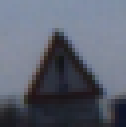

## Project: Build a Traffic Sign Recognition Program
[](http://www.udacity.com/drive)

Overview
---
In this project, deep neural networks and convolutional neural networks were used to classify traffic signs. A model was trained and validated so it can classify traffic sign images using the [German Traffic Sign Dataset](http://benchmark.ini.rub.de/?section=gtsrb&subsection=dataset). After the model was trained, the model was used to label images of German traffic signs found on the web.


Three main files are submitted here: a file containing project code and a file containing a brief write up explaining the solution. 
- [Traffic_Sign_Classifier.ipynb (code)](https://github.com/timotdsantos/CarND-Traffic-Sign-Classifier-Project/blob/master/Traffic_Sign_Classifier.ipynb)
- [report.html (exported code)](https://github.com/timotdsantos/CarND-Traffic-Sign-Classifier-Project/blob/master/report.html)
- [README.md (write up)](https://github.com/timotdsantos/CarND-Traffic-Sign-Classifier-Project/blob/master/README.md)

The Project
---
The goals / steps of this project are the following:
* Load the data set
* Explore, summarize and visualize the data set
* Design, train and test a model architecture
* Use the model to make predictions on new images
* Analyze the softmax probabilities of the new images
* Summarize the results with a written report

---
### Dependencies
This lab requires:

* [CarND Term1 Starter Kit](https://github.com/udacity/CarND-Term1-Starter-Kit)

The lab enviroment can be created with CarND Term1 Starter Kit. Click [here](https://github.com/udacity/CarND-Term1-Starter-Kit/blob/master/README.md) for the details.

### **Part 1:** Basic Summary of the Data Set 

* This is a pickled dataset in which the data was already resized to 32x32 images. It contains a training, validation and test set. It is not included in the repository, but should be downloaded [here](https://d17h27t6h515a5.cloudfront.net/topher/2017/February/5898cd6f_traffic-signs-data/traffic-signs-data.zip).

* Validation set is taken from the training data, which is an 80-20 split.

* Here is a basic summary of the data set:

        Number of training examples = 27839
        
        Number of testing examples = 12630
        
        Number of validation examples = 6960
        
        Image data shape = (32, 32, 3)
        
        Number of classes = 43
        
        Number of classes in validation = 43
        
        Number of classes in test = 43
        

* Here's a sample of the data:


* The street sign histogram (out of 43 types) are displayed below.

Train set:


Test set:


### **Part 2:** Input Data Preprocessing


**Preprocessing involves the following:**

**Gaussian Blur** was performed to remove noise in the data. A kernel size of 5x5 was finally used due to its impact on the overall validation set accuracy.

**Scaling** was performed using the Minimum and Maximum pixel intensity in an image. Doing this increases the color intensity's dynamic range.

**Transformation** was done to make sure that the input data, especially the ones taken from the internet, is compatible to the intended input to the CNN.

The street signs have 3-color (RGB) channels and have a 32x32 dimension. 


### **Part 3:** Model Architecture


The model is based on the LeNet-5 deep neural network model.
It consists of **5 layers.** 

**Input layer** in the LeNet-5 for MNIST data was intended to take in 1-channel image. Some experiments were performed to convert the street sign images to grayscale, but the performance benefits by retaining the color of the images.

**Layer 1:** Convolutional. Input = 32x32x3. Output = 28x28x6.

```python

    conv1_W = tf.Variable(tf.truncated_normal(shape=(5, 5, n_channels, 6), mean = mu, stddev = sigma))
    conv1_b = tf.Variable(tf.zeros(6))
    conv1   = tf.nn.conv2d(x, conv1_W, strides=[1, 1, 1, 1], padding='VALID') + conv1_b
```
**Layer 2:** Convolutional. Output = 10x10x16.

**Layer 3:** Fully Connected. Input = 400. Output = 120.

**Layer 4:** Fully Connected. Input = 120. Output = 84.

**Dropout** was implemented before the output layer to lessen the impact of overfitting. **Keep probability** of 0.80 after trying various values.
```python
fc2 = tf.nn.dropout(fc2, keep_prob)
.
.
.
batch_x, batch_y = X_data[offset:offset+BATCH_SIZE], y_data[offset:offset+BATCH_SIZE]
accuracy = sess.run(accuracy_operation, feed_dict={x: batch_x, y: batch_y, keep_prob: 1.0})
total_accuracy += (accuracy * len(batch_x)) keep_prob: 0.75})
```

**Layer 5:** Fully Connected. Input = 84. Output = 43.

The LeNet-5 in the lab exercise was meant for the MNIST data which is composed of 10 classes (digits) only. The final fully-connected output layer was modified to accommodate this.

```python
fc3_W  = tf.Variable(tf.truncated_normal(shape=(84, 43), mean = mu, stddev = sigma))
fc3_b  = tf.Variable(tf.zeros(43))
logits = tf.matmul(fc2, fc3_W) + fc3_b
    
return logits,conv1,conv2,fc0,fc1,fc2,fc3_W
```

### **Part 4:** Training and Evaluating the Model

The model was trained with the following parameters:

```
EPOCHS = 50
BATCH_SIZE = 128
optimizer :Adam Optimizer
```

The result of the training yielded around **97% validation accuracy**

```
.
.
.
EPOCH 48 ...
Validation Accuracy = 0.966

EPOCH 49 ...
Validation Accuracy = 0.965

EPOCH 50 ...
Validation Accuracy = 0.969
```

Evaluating the data on the holdout/test-set yielded a modest test accuracy of:

```Test Accuracy = 0.876```


### **Part 5:** Testing the Model on New Images

Upon applying the model on the five images downloaded from the internet, the results were as follows:


```Test Accuracy = 0.800```

 **predicted:  [31] 	truth:  31**

 **predicted:  [13] 	truth:  13**

 **predicted:  [25] 	truth:  25**

 **predicted:  [31] 	truth:  22**

 **predicted:  [17] 	truth:  17**


The one misclassification was the image **22[Bumpy road]** which was predicted as **26[Traffic Signals]**.


Inspecting the top-5 softmax values for the third image **#22[Bumpy Road]**, we see the following result:

```prob:  [ 0.55089307  0.18588537  0.15568347  0.09712765  0.0029154 ] label:  [26 19 18 22 24] truth:  22```


One observation is that the top softmax score is relatively low. Another is that the top 5 values themselves are relatively closer, meaning the model is not as confident with this prediction. Visually inspecting the other 2 better softmax scores (**top 2[#19 - Dangerous curve to the left]** and **top 3[#18 - Dangerous curve to the right]**), they are also similar in form -- red triangular signs, with some black figures inside.




Another thing to consider is the amount of training data available for those classes. Looking back at the histogram we see that the class **22[Bumpy road]**  is not well represented.


 
```